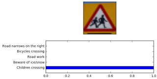

# Traffic Sign Classifier using Deep Neural Networks:

In this project, deep neural networks and convolutional neural networks are used to classify traffic signs. The model is trained to classify traffic signs from the German Traffic Sign Dataset. The source code of the project can be found on github. The training data set consists of 43 classes of traffic signs. Sample images of each class and its corresponding frequency in the training data set is shown below.

**Sample images of the training data set**

**Frequency of the different classes in the training set**

**Pre-processing of the data:**
I have converted the color images into gray cale images as the traffic signs have similar color combinations and thus these colors dont give any significant meaning/ feature to be picked up by the network. Hence I have droped the RGB values and concentrated mainly on the structure of the signs in gray scale.

Additional image data was generated to make classification, perspective and skew invariant, since sign classifier will be applied on images whose plane are parallel to the plane of the camera. Images will mostly appear skewed or 'perspective-transformed' in real life applications. So a transformation of the images per class is done to generate 2500 images per class. Rotation, Skewing and translation are applied to these images to get the transformed 2500 images per class. Total we have 2500*43 about 111000 images after transformation. 

**Frequency of transformed data set per class**

**The Architecture:**
The training model is built using Tensorflow containing 5 layers as described below:

* **Layer 1:** 
    * Convolution of 5x5 kernel, 1 stride and 16 feature maps 
    * Activation: ReLU 
    * Pooling: 2x2 kernel and 2 stride
* **Layer 2:**
    * Convolution of 5x5 kernel, 1 stride and 32 feature maps 
    * Activation: ReLU 
    * Pooling: 2x2 kernel and 2 stride
* **Layer 3:**
    * Fully connected layer with 516 units 
    * Activation: ReLU with dropout of 25%
* **Layer 4:**
    * Fully connected layer with 360 units 
    * Activation: ReLU with dropout of 25%
* **Layer 5:**
    * Fully connected layer with 43 units for network output 
    * Activation Softmax

The dropout of 25% is chosen during training to have a generalized model and to prevent over-fitting. Adam optimizer with learning rate of 0.001 and weights initialized with mean of 0 and standard deviation of 0.1 are chosen.
The model is trained on an Amazon Web Services EC2 GPU instance and it took about 20 minutes to train the model of batch size 256 and 100 epochs. 

**The validation accuracy attained 98.2% on the validation set and the test accuracy was about 94.7%**

After training the model, it is tested on new images of traffic signs found on the web. The models predictions and the images are shown below:

**Each set of predictions are with respect to the rows of the images**

**The top 5 predictions of the model for 5 images are shown below:**

**Image 1 - which is a Speed limit 50 is correct with highest probability.**

**Image 2 - Children crossing is about 1 probability.**

**Image 3 - Double curve is at the 3rd highest probability.**

**Image 4 - Bumpy road is in the 2nd highest probability, but compared to the highest probability (close to 1) this results as a bicycle crossing which is incorrect.**

**Image 5 - No entry, which is at the 3rd highest probability**

